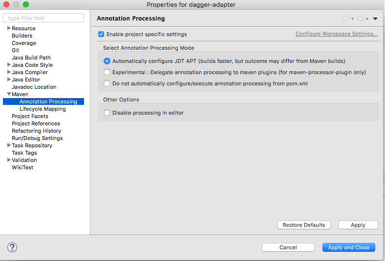

# dagger-multimodule-example
The goal of this project is to make a maven multi module project using Dagger, where de adapter will use services from the dagger-service module.

# Eclipse

If you are using eclipse, make sure to install https://marketplace.eclipse.org/content/m2e-apt. After this you will need to enable 'Annotation Processing' on your projects.

